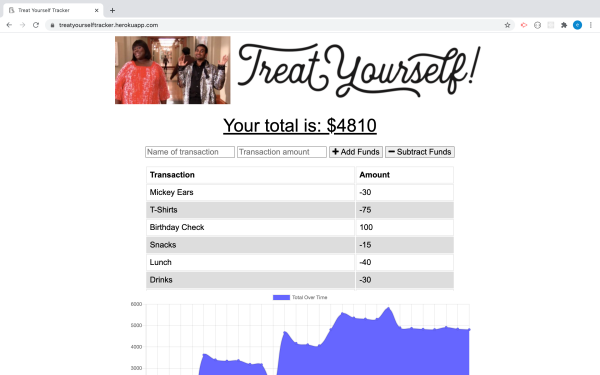

# TreatYourselfTracker  
# 

## TABLE OF CONTENTS
- [DESCRIPTION](#DESCRIPTION)  
- [LICENSE](#LICENSE)  
- [INSTALLATION](#INSTALLATION)  
- [TECHNOLOGIES](#TECHNOLOGIES)  
- [QUESTIONS](#QUESTIONS)  
- [CONTRIBUTIONS](#CONTRIBUTIONS)
- [LINKS](#LINKS)  
- [SCREENSHOTS](#SCREENSHOTS)  

## DESCRIPTION
Welcome to Treat Yourself Tracker - an application that allows the user to allows the user to document purchases & deposits, both online and offline. Perfect for a traveler who may not always have access to WiFi! Since keeping track of one's money is vital, I wanted the user to be have to have offline functionality so they can have the most up-to-date information at all times! No more searching for public wifi, hotspots, or wasting data! Enjoy the ease of the Treat Yourself Tracker as you treat yourself!  

## LICENSE
NONE

## INSTALLATION
Run "npm i" to install all packages.

## TECHNOLOGIES
- JavaScript  
  - express.js
- MongoDB/Atlas  
- Mongoose  
- Cache  
- IndexedDB  

## QUESTIONS 
My GitHub username is *eplatvoet* & my profile can be found [here](https://github.com/eplatvoet) 

## CONTRIBUTIONS
Feel free to fork the repository if any upgrades/features can be implemented. I can be reached at erin.didomenico520@gmail.com if you have any other questions about this repository.

## LINKS
[REPO](https://github.com/eplatvoet/TreatYourselfTracker)  
[HEROKU](https://treatyourselftracker.herokuapp.com/)  

## SCREENSHOTS
  
  

